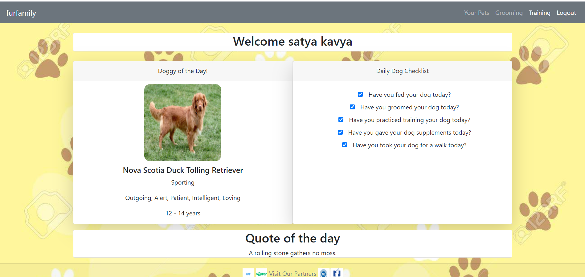
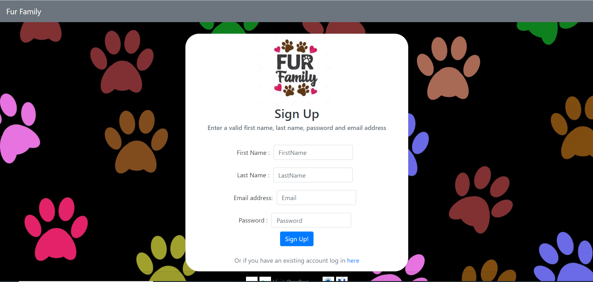

# FurFamily

 ## Description
  
  This is a full stack application about pets.This applicatin can be used by any pet lovers to manage their pet details.Any pet lover using this application should be able to 

  * Create an account on furfamily
  * Login using credentials provided while signing up
  * Save your pet details
  * Add as many pets as you have
  * Delete pet
  * Watch pet grooming videos
  * Watch pet training videos
  * Have a checklist of things to-do with the pets like feeding, grooming etc.
  * View pet of the day
  * Quote of the day
  * Navigate to pet friendly websites

  Table of contents | 
  ------------ | 
  [Description](#description) | 
  [Technologies used](#technologies-used) | 
  [Features](#features) | 
  [Application sample webpages](#application-sample-webpages) | 
  [Contributors](#contributors) | 
  [Github Repository](#github-repository) | 
  [Heroku Link](#heroku-link) | 
  [Contact](#contact) | 
  

# Technologies used:
* Front-end : HTML, CSS, BOOTSTRAP
* Back-end :Javascript, Jquery, Express.js, Node.js, ES6, passport and sequelize(libraries), MySql Database
* Deployed in Heroku

# Features:

* Create account and login
* User Aunthentication system
* User-friendly
* CRUD operations for save, display and delete pet details
* Random dog API
* Quote of the day API
* youtube videos API
* Link to other pet friendly websites
* Polished UI
* MVC paradigm
* Protecting database deatils using environmental variables
  
 

  # Application sample webpages

  
  # Contributors

  Mark Aguilar
  satya kavya
  Cristina Ruiz
  Daniel Rodriguez
  Devin McComb

 # Github Repository
   https://github.com/cristinaruiz21/FurFamily

# Heroku Link

  # Contact
  ___________________________________________________________________
 * m_aguilar_2011@yahoo.com
 *  satyakavya24@gmail.com
  

  @copyright 2020
